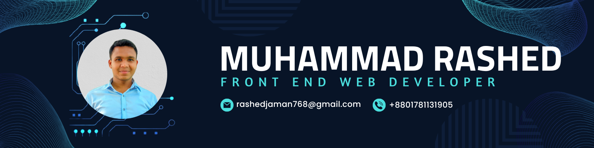

<h1 align="center">As-salamu alaykum 🤝, I'm Muhammad Rashed</h1>
<h3 align="center">A passionate frontend developer from Bangladesh</h3>

# 💫 About Me:
I specialize in building responsive, user-friendly web interfaces that deliver exceptional user experiences. As a Front-End Developer, I have expertise in HTML, CSS, JavaScript, and React, along with experience in Firebase Authentication and Git and also Familiar to Node.js, Express.js, MongoDB and Next.js. I am passionate about crafting modern, scalable, and secure web solutions with a strong focus on usability and innovation. Beyond coding, I love reading books and exploring new places through travel, which inspires my creativity and fuels my passion for continuous learning. With a keen eye for detail, I thrive on transforming ideas into impactful digital experiences. Let's connect and collaborate to create something extraordinary! With a keen eye for detail, I thrive on transforming ideas into impactful digital experiences. Let's connect and collaborate to create something extraordinary!

🔭 I’m working as Frontend Developer 🌱I'm currently learning Next.js, Express.js, Node.js, Redux ⚡In my free time I like to read and travel

## 🌐 Socials:

  

# 💻 Tech Stack:

<h3>Front End</h3>

        

<h3> Back End </h3>

  

<h3> Tools</h3>

           

# 📊 GitHub Stats:

 
 

## 🏆 GitHub Trophies
## 🏆 Achievements

### ✍️ Random Dev Quote

---

### 🔝 Top Contributed Repo

---

<!-- Proudly created with GPRM ( https://gprm.itsvg.in ) -->

