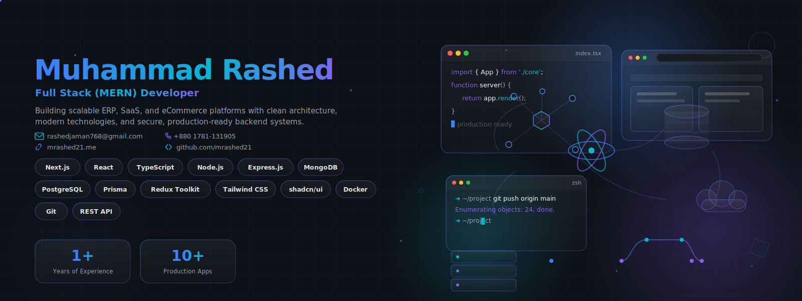

<div align="center">



<a href="https://git.io/typing-svg">
  
</a>

<p>
  <a href="https://www.mrashed21.me/"></a>
  <a href="https://www.linkedin.com/in/mrashed21//"></a>
  <a href="https://www.facebook.com/mrasheed21"></a>
  <a href="mailto:rashedjaman768@gmail.com"></a>
  <a href="https://github.com/mrashed21"></a>
  <a href="https://wa.me/8801781131905"></a>
</p>

</div>

<br>

## 👋 About Me

I'm a **Full Stack (MERN) Developer** with hands-on experience building scalable, production-ready web applications — from concept to deployment. I specialize in modern, high-performance systems with clean architecture, responsive interfaces, and secure backends.

I've worked across **ERP solutions, SaaS platforms, multi-vendor eCommerce, restaurant & POS software, bus booking systems, and admin dashboards** — shipping reliable products that improve real business operations and user experience.

> [!NOTE]
>
> ## 👨‍💻 `developer_profile.ts`
>
> ```js
> const mrashed21 = {
>   role: "Full Stack (MERN) Developer",
>   focus: ["Clean Architecture", "Scalable Systems", "DX & Performance"],
>   currently_learning: ["Image Searching", "Docker", "System Design"],
>   fun_fact: "Reads books & travels when not shipping code",
> };
> ```

<br>

## 🧩 Tech Stack

**Frontend**

<p align="left">


</p>

**Backend**

<p align="left">


</p>

**Database**

<p align="left">


</p>

**Tools & Platforms**

<p align="left">


</p>

<br>

## 🚀 What I've Built

- ⚙️ **ERP modules** for inventory, sales, purchasing, and business management
- 🛠️ **SaaS admin panels** with role & permission management
- 🛒 **Multi-vendor eCommerce platforms**
- 🍽️ **Restaurant management & POS systems**
- 🚌 **Bus booking system** with dynamic seat selection
- 📦 **Product management** with categories, brands, variations & attributes
- 🔐 **Secure authentication** using JWT & OTP verification
- 💳 **Payment-ready order workflows**
- 📊 **Responsive dashboards** with real-time analytics
- 🔎 **AI-powered image-based product search**
- 🧱 **Scalable REST APIs** with reusable backend architecture

<br>

## 🏆 Professional Highlights

- ✅ Delivered **10+ production-ready** commercial applications on time
- ✅ Built scalable **MERN** applications with reusable, maintainable architecture
- ✅ Developed complete **end-to-end** frontend and backend solutions
- ✅ Improved application performance, SEO, and overall UX
- ✅ Collaborated directly with clients to ship reliable business software
- ✅ Maintained and enhanced enterprise-level applications post-launch

<br>

## 🎯 Currently

- 🔭 Working as a **Full Stack (MERN) Developer**
- 🌱 Currently deepening my skills in **Next.js, System Design & Docker**
- 💬 Ask me about **React, Node.js, PostgreSQL, or building ERP/SaaS systems**
- ⚡ In my free time, I read books and travel — it fuels how I think and build
- 📌 Open to **Remote / Hybrid / Onsite** roles as a Full Stack (MERN) or Backend Developer

<br>

## 📊 GitHub Stats

<div align="center">
 
 

</div>
<br>

## 🌐 Let's Connect

<div align="center">
  <a href="https://www.mrashed21.me/"></a>
  <a href="https://github.com/mrashed21"></a>
  <a href="https://www.linkedin.com/in/mrashed21/"></a>
  <a href="https://www.facebook.com/mrasheed21"></a>
  <a href="mailto:rashedjaman768@gmail.com"></a>
  <a href="https://wa.me/8801781131905"></a>
</div>

<br>

<div align="center">
<sub>Thanks for stopping by — always open to interesting problems and good conversations. 🚀</sub>
</div>
